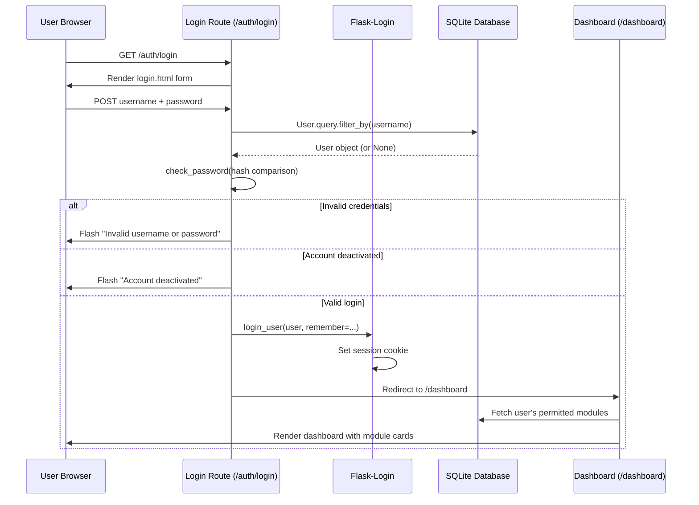
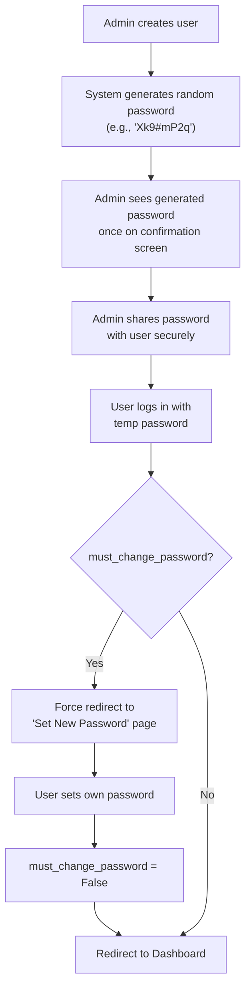

# Auth Module — Backend Deep Dive & Issues Analysis

## 1. How the Auth Backend Works (Current Flow)



### Key Backend Components

| File | Purpose |
|---|---|
| [extensions.py](file:///c:/JGpc/app_at_present/app/extensions.py) | Creates `LoginManager` — sets `login_view='auth.login'` so unauthenticated users are redirected to login |
| [models.py](file:///c:/JGpc/app_at_present/app/models.py#L25-L60) | `User` model — `set_password()` hashes with pbkdf2:sha256, `check_password()` verifies, `has_module()` checks permissions |
| [auth/routes.py](file:///c:/JGpc/app_at_present/app/auth/routes.py) | **Login** (line 11-30): validates form → queries user → checks hash → `login_user()` → redirects. **Logout** (line 33-38): `logout_user()` → redirect to login |
| [decorators.py](file:///c:/JGpc/app_at_present/app/decorators.py) | `@admin_required` — aborts 403 if not admin. `@module_required(slug)` — checks `user_modules` table, admin bypasses |
| [__init__.py](file:///c:/JGpc/app_at_present/app/__init__.py#L79-L89) | Context processor injects `user_modules` into **every** template so the sidebar dynamically shows only permitted modules |

### Password Security
- Passwords are hashed using Werkzeug's `generate_password_hash` (pbkdf2:sha256, ~260k iterations)
- Plain-text password is **never** stored — only the hash
- Comparison uses constant-time `check_password_hash` to prevent timing attacks

---

## 2. Issues You Reported

### Issue A: "Unable to see the Logout in interface"

**The logout link DOES exist** in the code — it's in [base.html line 84-89](file:///c:/JGpc/app_at_present/app/templates/base.html#L84-L89):

```html
<div class="sidebar-footer">
    <a href="{{ url_for('auth.logout') }}" class="nav-link">
        <i class="fas fa-right-from-bracket"></i>
        <span>Logout</span>
    </a>
</div>
```

> [!WARNING]
> **The problem:** The logout link is at the **very bottom** of the sidebar. If the sidebar has many modules, the logout link may be **scrolled out of view** on smaller screens, OR the `sidebar-footer` `.nav-link` styling doesn't match the sidebar nav-link styling (the CSS for `.sidebar-footer .nav-link` is **missing** — only `.sidebar-nav .nav-link` is styled).

**Root cause:** The `.sidebar-footer` has no explicit link styling, so the logout link may appear **invisible** (default link color on dark background = unreadable).

### Issue B: "Directly opening Dashboard after signed in"

This is **by design** in the current code:

```python
# auth/routes.py line 13-14
if current_user.is_authenticated:
    return redirect(url_for('main_dashboard'))
```

If you're already logged in (session cookie still active), visiting `/` or `/auth/login` **skips the login page** and goes straight to dashboard. This is standard behavior.

**If you want to switch accounts**, you must **first logout** — but since logout is hard to find (Issue A), it feels like you're stuck.

### Issue C: "Admin creates user with a manual password"

Currently in [admin/routes.py line 38-65](file:///c:/JGpc/app_at_present/app/admin/routes.py#L38-L65), the admin **manually types a password** when creating a user:

```python
user.set_password(form.password.data)  # Admin chooses the password
```

This is **not ideal** because:
1. Admin knows the user's password (security risk)
2. No mechanism for the user to set their own password
3. No "first login" password change enforcement

---

## 3. Proposed Improvements

### What needs to change:

| # | Change | Complexity |
|---|---|---|
| 1 | **Fix logout visibility** — Add proper styling + add logout to top navbar as well | Simple CSS fix |
| 2 | **Add "Switch Account" / visible logout** — Put a logout button in the top-right user menu area | Small template change |
| 3 | **Auto-generate password** when admin creates user — Generate a random temp password, display it once, and flag the user for mandatory password change | Medium (model + route changes) |
| 4 | **First-login password reset** — Force users with `must_change_password=True` to set their own password before accessing any module | Medium (decorator + template) |

### Proposed Auth Flow After Changes:



---

## 4. Your Question: "Is this suitable?"

> [!IMPORTANT]
> **Yes, the auto-generated password + forced password change approach is the correct enterprise pattern.** Here's why:
> - Admin never knows the final password
> - Each user owns their credentials
> - Temporary passwords expire on first use
> - It follows the principle of least privilege

### What I need from you to proceed:

1. **Should I implement all 4 changes** (logout fix, switch account, auto-password, first-login reset)?
2. **Password format preference** — Should the auto-generated password be:
   - Random string like `Xk9#mP2q` (8 chars)?
   - Or a readable format like `Welcome@123` + username suffix?
3. **Should the admin be able to see/copy the generated password** on the success page, or should it also be emailed? (Email requires SMTP setup)
