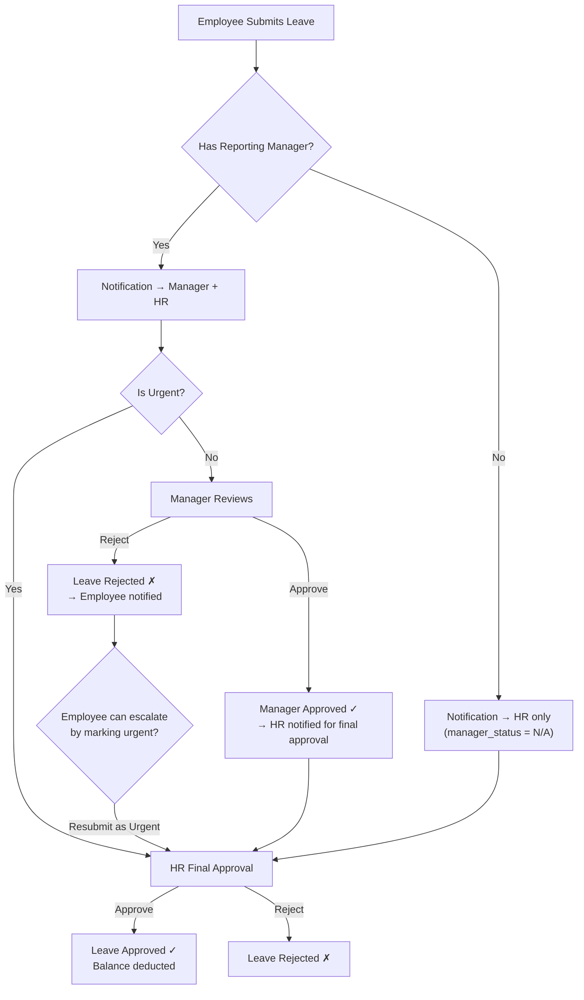

# Manager-Based Leave Approval Workflow

## Problem
The current leave system has `manager_status` and `hr_status` columns on the `Leave` model, but:
- There is **no `reporting_manager_id`** on the `Employee` model — the system doesn't know who manages whom.
- There is **no manager-facing UI** — only HR/Admin can approve leaves.
- The `approve_leave()` route in HR always calls `step='hr'`, bypassing the manager step entirely.
- Result: The "Manager" column in the leave table is cosmetic — always stuck at "Pending".

## Solution
Implement a real **Employee → Manager → HR** leave approval workflow, mirroring how organizations work:
1. **Employee submits** leave → notification sent to **Manager** AND **HR** (like email to TL with HR in CC).
2. **Manager approves/rejects** from their Employee dashboard ("My Team" section).
3. **HR gives final approval** after manager approves. HR can also override/fast-track if needed.
4. If employee has **no manager assigned** (senior-level employees), skip the manager step → goes straight to HR.

---

## User Review Required

> [!IMPORTANT]
> **Database Migration Required**: Adding `reporting_manager_id` to the `employees` table requires a migration. Existing employees will have `NULL` (no manager), which means their leaves will go straight to HR — this is the intended fallback.

> [!IMPORTANT]
> **Seed Data Update**: The seed data will be updated so that some employees report to others (e.g., Junior employees report to a Team Lead). You'll need to re-run `seed_data.py` or manually assign managers via the HR employee edit form.

---

## Proposed Changes

### Phase 1: Database Model — Add Reporting Manager

#### [MODIFY] [models.py](file:///c:/JGpc/app_at_present/app/models.py)

Add `reporting_manager_id` to `Employee`:

```python
class Employee(db.Model):
    ...
    reporting_manager_id = db.Column(db.Integer, db.ForeignKey('employees.id'), nullable=True)
    
    # Self-referential relationship
    reporting_manager = db.relationship('Employee', remote_side='Employee.id',
                                        backref=db.backref('direct_reports', lazy='dynamic'),
                                        foreign_keys=[reporting_manager_id])
    
    @property
    def manager_name(self):
        return self.reporting_manager.user.full_name if self.reporting_manager else 'None'
    
    @property
    def manager_user_id(self):
        """Get the User ID of the reporting manager (for notifications)."""
        return self.reporting_manager.user_id if self.reporting_manager else None
```

Add `is_urgent` flag to `Leave` for escalation to HR:

```python
class Leave(db.Model):
    ...
    is_urgent = db.Column(db.Boolean, default=False)  # Urgent leaves skip to HR
```

#### [MODIFY] [schema.sql](file:///c:/JGpc/app_at_present/schema.sql)

Add `reporting_manager_id` column to employees table and `is_urgent` to leaves table.

---

### Phase 2: HR Module — Manager Assignment

#### [MODIFY] [forms.py](file:///c:/JGpc/app_at_present/app/hr/forms.py)

Add `reporting_manager_id` dropdown to `EmployeeForm`:

```python
class EmployeeForm(FlaskForm):
    ...
    reporting_manager_id = SelectField('Reporting Manager', coerce=int, validators=[Optional()])
```

#### [MODIFY] [routes.py](file:///c:/JGpc/app_at_present/app/hr/routes.py)

- **`edit_employee()`**: Populate the reporting manager dropdown with all active employees (excluding self). Save `reporting_manager_id`.
- **`complete_profile()`**: Also allow setting the reporting manager during onboarding.
- **`leave_action()`**: Update to pass `step='hr'` explicitly (already does this, but add clarity about the 2-step flow).

#### [MODIFY] [services.py](file:///c:/JGpc/app_at_present/app/hr/services.py)

- **`get_managers_for_dropdown()`**: New helper returning employees who can serve as managers (all employees for now, or filter by designation level ≥ 3).
- **`approve_leave()`**: Already supports `step` param — no change needed here.
- **`is_employee_profile_complete()`**: Manager assignment is **not** mandatory for profile completeness (senior employees may not have one).

---

### Phase 3: Leave Submission — Dual Notification (Manager + HR)

#### [MODIFY] [services.py](file:///c:/JGpc/app_at_present/app/employee/services.py)

Update `submit_leave_request()`:

```python
def submit_leave_request(employee, leave_type, start_date, end_date, reason='', is_urgent=False, ip=''):
    ...
    leave = Leave(
        employee_id=employee.id,
        leave_type=leave_type,
        start_date=start_date,
        end_date=end_date,
        reason=reason,
        status='Pending',
        is_urgent=is_urgent,
    )
    
    # Set manager_status based on whether employee has a manager
    if not employee.reporting_manager_id:
        leave.manager_status = 'N/A'  # Skip manager step
    else:
        leave.manager_status = 'Pending'
    
    leave.hr_status = 'Pending'
    
    # Notify MANAGER (like emailing Team Lead)
    if employee.reporting_manager:
        create_notification(
            employee.manager_user_id,
            'Leave Request from Team Member',
            f'{employee.user.full_name} has requested {leave_type} leave ...',
            category='warning',
            link='/employee/team/leaves'
        )
    
    # Notify HR (like CC in the email)
    hr_module = Module.query.filter_by(slug='hr').first()
    if hr_module:
        for hr_user in hr_module.users:
            create_notification(
                hr_user.id,
                'Leave Request Submitted',
                f'{employee.user.full_name} has applied for {leave_type} leave ...',
                category='info',
                link='/hr/leaves'
            )
```

#### [MODIFY] [forms.py](file:///c:/JGpc/app_at_present/app/employee/forms.py)

Add `is_urgent` checkbox to `LeaveRequestForm`:

```python
class LeaveRequestForm(FlaskForm):
    ...
    is_urgent = BooleanField('Mark as Urgent (direct HR review)', validators=[Optional()])
```

#### [MODIFY] [routes.py](file:///c:/JGpc/app_at_present/app/employee/routes.py)

Update `request_leave()` to pass `is_urgent` from form.

---

### Phase 4: "My Team" Section in Employee Module (Core Feature)

This is the **main new UI** — managers see their direct reports' leave requests and can approve/reject them.

#### [MODIFY] [services.py](file:///c:/JGpc/app_at_present/app/employee/services.py)

Add new team management services:

```python
def get_direct_reports(employee_id):
    """Get employees who report to this manager."""
    return Employee.query.filter_by(
        reporting_manager_id=employee_id, is_active=True
    ).all()

def is_manager(employee_id):
    """Check if this employee has any direct reports."""
    return Employee.query.filter_by(
        reporting_manager_id=employee_id, is_active=True
    ).count() > 0

def get_team_leaves(employee_id, status=None):
    """Get leave requests from direct reports."""
    report_ids = [r.id for r in get_direct_reports(employee_id)]
    if not report_ids:
        return []
    query = Leave.query.filter(Leave.employee_id.in_(report_ids))
    if status:
        query = query.filter_by(status=status)
    return query.order_by(Leave.created_at.desc()).all()

def get_team_pending_count(employee_id):
    """Count pending leaves from direct reports awaiting manager action."""
    report_ids = [r.id for r in get_direct_reports(employee_id)]
    if not report_ids:
        return 0
    return Leave.query.filter(
        Leave.employee_id.in_(report_ids),
        Leave.manager_status == 'Pending',
        Leave.status == 'Pending'
    ).count()

def manager_approve_leave(leave_id, manager_employee_id):
    """Manager approves a direct report's leave. Returns (success, msg)."""
    leave = Leave.query.get(leave_id)
    if not leave or leave.status != 'Pending':
        return False, 'Leave not found or already processed'
    
    # Verify this manager actually manages this employee
    emp = Employee.query.get(leave.employee_id)
    if not emp or emp.reporting_manager_id != manager_employee_id:
        return False, 'You are not authorized to approve this leave'
    
    manager = Employee.query.get(manager_employee_id)
    leave.manager_status = 'Approved'
    leave.manager_approved_by = manager.user_id
    
    # Notify HR that manager has approved — awaiting HR final approval
    create_notification(...)
    
    # Notify employee that manager approved
    create_notification(...)
    
    return True, 'Leave approved by manager. Awaiting HR final approval.'

def manager_reject_leave(leave_id, manager_employee_id, reason=''):
    """Manager rejects a direct report's leave."""
    leave = Leave.query.get(leave_id)
    ...
    leave.manager_status = 'Rejected'
    leave.manager_approved_by = manager.user_id
    leave.status = 'Rejected'
    leave.rejection_reason = reason
    
    # Notify employee
    create_notification(...)
    
    return True, 'Leave rejected by manager.'
```

#### [MODIFY] [routes.py](file:///c:/JGpc/app_at_present/app/employee/routes.py)

Add new "My Team" routes:

```python
# --- MY TEAM SECTION ---

@bp.route('/team')
@module_required('employee')
def my_team():
    """Manager: View direct reports."""
    employee = get_current_employee_or_abort()
    if not services.is_manager(employee.id):
        flash('You do not have any team members.', 'info')
        return redirect(url_for('employee.dashboard'))
    
    reports = services.get_direct_reports(employee.id)
    pending_count = services.get_team_pending_count(employee.id)
    return render_template('employee/my_team.html',
                           reports=reports, pending_count=pending_count)

@bp.route('/team/leaves')
@module_required('employee')
def team_leaves():
    """Manager: View and manage team leave requests."""
    employee = get_current_employee_or_abort()
    status_filter = request.args.get('status', '')
    leaves = services.get_team_leaves(employee.id, status=status_filter or None)
    pending_count = services.get_team_pending_count(employee.id)
    return render_template('employee/team_leaves.html',
                           leaves=leaves, pending_count=pending_count,
                           selected_status=status_filter)

@bp.route('/team/leaves/<int:leave_id>/approve', methods=['POST'])
@module_required('employee')
def team_approve_leave(leave_id):
    """Manager: Approve a team member's leave."""
    ...

@bp.route('/team/leaves/<int:leave_id>/reject', methods=['POST'])
@module_required('employee')
def team_reject_leave(leave_id):
    """Manager: Reject a team member's leave."""
    ...
```

#### [NEW] [my_team.html](file:///c:/JGpc/app_at_present/app/templates/employee/my_team.html)

Manager's team overview page showing:
- List of direct reports with their info
- Quick stats (team size, pending leaves)
- Link to team leaves

#### [NEW] [team_leaves.html](file:///c:/JGpc/app_at_present/app/templates/employee/team_leaves.html)

Manager's leave approval page showing:
- Table of team leave requests (similar to HR leaves page)
- Approve/Reject buttons for pending requests
- Status filter (All, Pending, Approved, Rejected)
- Manager can only see leaves from their direct reports

---

### Phase 5: Sidebar & Dashboard Updates

#### [MODIFY] [base.html](file:///c:/JGpc/app_at_present/app/templates/base.html)

Add "My Team" link in the Employee Space sidebar section — **only visible if the user is a manager**:

```html

<a href="{{ url_for('employee.my_team') }}" class="nav-link" style="padding:5px 10px; font-size:0.8rem;">
    <i class="fas fa-users" style="width:16px; font-size:0.75rem;"></i>
    <span>My Team</span>
    
    <span class="badge bg-warning ms-auto">{{ team_pending_count }}</span>
    
</a>

```

#### [MODIFY] [__init__.py](file:///c:/JGpc/app_at_present/app/__init__.py)

Update the context processor that provides `user_modules` to also inject `is_manager` and `team_pending_count` for sidebar badge.

#### [MODIFY] [dashboard.html](file:///c:/JGpc/app_at_present/app/templates/employee/dashboard.html)

Add a "My Team" card on the employee dashboard when `is_manager` is True:
- Shows pending team leave count with "Review" button.

---

### Phase 6: HR Leave Page — Show Manager Approval Step Properly

#### [MODIFY] [leaves.html](file:///c:/JGpc/app_at_present/app/templates/hr/leaves.html)

Update to properly show the workflow:
- **Manager column**: Show `Pending` / `Approved by [Name]` / `Rejected by [Name]` / `N/A`
- **HR column**: Show `Pending` / `Approved` / `Rejected`
- HR should see a visual indicator when manager has approved (green checkmark) but HR hasn't yet.
- HR can still approve/reject regardless of manager status (override capability).

---

### Phase 7: Seed Data

#### [MODIFY] [seed_data.py](file:///c:/JGpc/app_at_present/seed_data.py)

Add reporting manager assignments:
- Assign senior employees as managers for junior employees.
- Example: `Priya Sharma (EMP001, General designation)` → manager for `Rahul Verma (EMP002)` and `Bob Wilson (EMP006)`.
- High-level employees (e.g., department heads) have `reporting_manager_id = NULL` → leaves go directly to HR.

---

### Phase 8: Migration

#### [NEW] Migration script

Create a new Alembic migration to add:
- `reporting_manager_id` column to `employees` table (nullable, FK to `employees.id`)
- `is_urgent` column to `leaves` table (boolean, default False)

---

## Workflow Summary



---

## Verification Plan

### Automated Tests
1. **Migration**: Run `flask db upgrade` and verify `reporting_manager_id` and `is_urgent` columns exist.
2. **Seed Data**: Run `python seed_data.py` and verify manager assignments via DB query.
3. **App Startup**: Run `flask run` and confirm no import/route errors.

### Manual Verification (Browser Testing)
1. **HR assigns manager**: Go to HR → Employee Edit → Set Reporting Manager.
2. **Employee submits leave**: Login as employee, submit a leave → verify notifications sent to both manager and HR.
3. **Manager approves**: Login as the manager → go to "My Team" → "Team Leaves" → Approve leave → verify `manager_status` changes.
4. **HR final approval**: Login as HR → go to Leaves → see manager approval status → give final approval → verify balance deducted.
5. **No-manager employee**: Login as a senior employee with no manager → submit leave → verify it goes directly to HR (manager_status = N/A).
6. **Urgent leave**: Submit an urgent leave → verify HR gets priority notification.

### Files Changed Summary

| File | Action | Description |
|------|--------|-------------|
| `app/models.py` | MODIFY | Add `reporting_manager_id` to Employee, `is_urgent` to Leave |
| `schema.sql` | MODIFY | Add new columns |
| `app/hr/forms.py` | MODIFY | Add reporting manager dropdown |
| `app/hr/routes.py` | MODIFY | Handle reporting manager in employee edit |
| `app/hr/services.py` | MODIFY | Add `get_managers_for_dropdown()` |
| `app/employee/forms.py` | MODIFY | Add `is_urgent` checkbox |
| `app/employee/services.py` | MODIFY | Add team services, update leave submission |
| `app/employee/routes.py` | MODIFY | Add My Team routes |
| `app/templates/base.html` | MODIFY | Add My Team sidebar link |
| `app/__init__.py` | MODIFY | Inject `is_manager` context |
| `app/templates/employee/my_team.html` | NEW | Team overview page |
| `app/templates/employee/team_leaves.html` | NEW | Team leave management page |
| `app/templates/employee/dashboard.html` | MODIFY | Add team card for managers |
| `app/templates/employee/leave_request.html` | MODIFY | Add urgent checkbox |
| `app/templates/hr/leaves.html` | MODIFY | Show manager approval name |
| `app/templates/hr/employee_form.html` | MODIFY | Add reporting manager dropdown |
| `seed_data.py` | MODIFY | Add manager assignments |
| `migrations/versions/xxx.py` | NEW | Migration for new columns |
