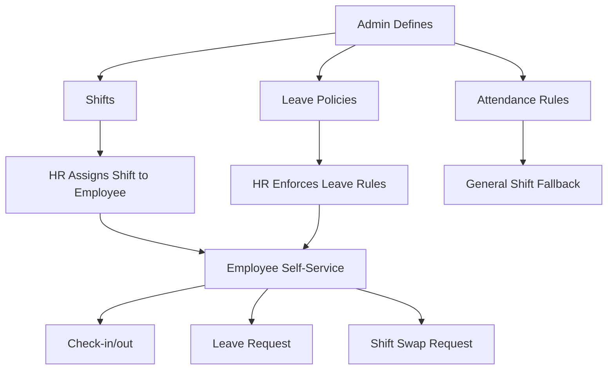

# Leave, Attendance & Shift Management — Walkthrough

## Overview

This module extends the existing Enterprise Portal with a complete **Leave Management + Attendance + Shift Management** system, following the Admin → HR → Employee hierarchy.

| Layer | Responsibility |
|-------|---------------|
| **Admin** | Defines shifts, role-based leave policies, attendance rules |
| **HR** | Manages employees within those rules — approvals, overrides, operations |
| **Employee** | Self-service — check-in, leave requests, shift swap, comp-off view |

---

## Architecture Summary



---

## Changes By Phase

### Phase 1: Database Models & Schema

#### [MODIFY] [models.py](file:///c:/JGpc/app_at_present/app/models.py)

**New Models:**
- `Shift` — shift schedules (start/end time, grace period, late mark threshold, OT eligibility)
- `CompOff` — comp-off records earned from overtime
- `ShiftSwapRequest` — employee shift change requests with approval workflow

**Modified Models:**
- `LeavePolicy` — added `designation_id` for role-based policies, `monthly_accrual`, `encashment_allowed`, `max_per_request`, `blackout_dates`
- `Employee` — added `shift_id` FK + `shift_name` property
- `Leave` — added `manager_status`, `hr_status`, `manager_approved_by`, `hr_approved_by` for 2-step approval
- `Attendance` — added `is_overnight` flag, updated `calc_working_hours()` for night shifts

#### [MODIFY] [schema.sql](file:///c:/JGpc/app_at_present/schema.sql)
- Added `shifts`, `comp_offs`, `shift_swap_requests` tables
- Updated `employees`, `leaves`, `attendance`, `leave_policies` columns

---

### Phase 2: Admin Module

#### [MODIFY] [config_forms.py](file:///c:/JGpc/app_at_present/app/admin/config_forms.py)
- New `ShiftForm` for shift CRUD
- Updated `LeavePolicyForm` with designation dropdown, accrual, encashment, blackout dates

#### [MODIFY] [routes.py](file:///c:/JGpc/app_at_present/app/admin/routes.py)
- **New routes:** `/shifts`, `/shifts/add`, `/shifts/<id>/edit`
- **Updated:** Leave policy routes with designation linkage
- **Dashboard:** Added `total_shifts` and `total_leave_policies` counts

#### New Templates:
- [shifts.html](file:///c:/JGpc/app_at_present/app/templates/admin/shifts.html) — shift list with employee counts
- [shift_form.html](file:///c:/JGpc/app_at_present/app/templates/admin/shift_form.html) — add/edit shift form

#### Updated Templates:
- [dashboard.html](file:///c:/JGpc/app_at_present/app/templates/admin/dashboard.html) — Shifts link with count badge
- [leave_policies.html](file:///c:/JGpc/app_at_present/app/templates/admin/leave_policies.html) — role column, accrual/encashment columns
- [leave_policy_form.html](file:///c:/JGpc/app_at_present/app/templates/admin/leave_policy_form.html) — all new fields

---

### Phase 3: HR Module

#### [MODIFY] [services.py](file:///c:/JGpc/app_at_present/app/hr/services.py) — Major Upgrade

| Service | Description |
|---------|-------------|
| `get_shift_rules_for_employee()` | Returns shift-specific timing, falls back to General Shift |
| `perform_checkin()` | Shift-aware check-in with late detection, night shift support |
| `perform_checkout()` | Calculates hours, auto-earns comp-off for OT-eligible shifts |
| `auto_mark_absent()` | Marks absent for employees with no attendance and no leave |
| `override_attendance()` | HR manual override for any attendance record |
| `get_leave_policies_for_employee()` | Returns designation-specific policies, falling back to global |
| `validate_leave_request()` | Blackout date checking, max-per-request, balance validation |
| `approve_leave()` / `reject_leave()` | Multi-step workflow (manager → HR) |
| `approve_shift_swap()` / `reject_shift_swap()` | Processes shift change requests |
| `approve_comp_off()` | Approves overtime comp-off claims |

#### [MODIFY] [forms.py](file:///c:/JGpc/app_at_present/app/hr/forms.py)
- Added `shift_id` to `EmployeeForm`
- Added `AttendanceOverrideForm`
- Updated `AttendanceFilterForm` — "On Leave" status option

#### [MODIFY] [routes.py](file:///c:/JGpc/app_at_present/app/hr/routes.py)
- **New routes:** Shift swaps, comp-offs, attendance override, auto-absent
- **Updated:** Employee edit with shift assignment, dashboard with new stats

#### New Templates:
- [shift_swap_requests.html](file:///c:/JGpc/app_at_present/app/templates/hr/shift_swap_requests.html)
- [comp_offs.html](file:///c:/JGpc/app_at_present/app/templates/hr/comp_offs.html)
- [attendance_override.html](file:///c:/JGpc/app_at_present/app/templates/hr/attendance_override.html)

#### Updated Templates:
- [dashboard.html](file:///c:/JGpc/app_at_present/app/templates/hr/dashboard.html) — shift swap, comp-off, override quick actions
- [leaves.html](file:///c:/JGpc/app_at_present/app/templates/hr/leaves.html) — multi-step approval columns (Manager ✓/✗, HR ✓/✗)
- [employee_form.html](file:///c:/JGpc/app_at_present/app/templates/hr/employee_form.html) — shift dropdown

---

### Phase 4: Employee Module

#### [MODIFY] [services.py](file:///c:/JGpc/app_at_present/app/employee/services.py)
- `get_my_shift()`, `get_my_shift_rules()`, `get_my_comp_offs()`, `get_my_shift_swap_requests()`
- `submit_shift_swap_request()` — with HR notification

#### [MODIFY] [routes.py](file:///c:/JGpc/app_at_present/app/employee/routes.py)
- **New routes:** `/shift-swap` (GET+POST), `/comp-offs`
- **Updated:** Dashboard passes shift rules + comp-off count
- **Updated:** Leave request/balance use role-based policies

#### New Templates:
- [shift_swap.html](file:///c:/JGpc/app_at_present/app/templates/employee/shift_swap.html) — current shift info, request form, history
- [comp_offs.html](file:///c:/JGpc/app_at_present/app/templates/employee/comp_offs.html) — comp-off records view

#### Updated Templates:
- [dashboard.html](file:///c:/JGpc/app_at_present/app/templates/employee/dashboard.html) — shift info bar, comp-off badge, shift swap/comp-off quick actions

---

### Phase 5: Seed Data

#### [MODIFY] [seed_data.py](file:///c:/JGpc/app_at_present/seed_data.py)
- 3 shifts created: Morning (06–14), Afternoon (14–22), Night (22–06)
- 3 global leave policies + 3 designation-specific policies
- Shift assignments: John→Morning, Jane→Afternoon, Bob→Night
- Sample comp-off records (2 earned + 1 used)
- Sample shift swap requests (1 pending + 1 approved)

---

## Verification

```
Shifts: 3 ✓
Leave Policies: 6 (3 global + 3 role-specific) ✓
CompOffs: 3 ✓
ShiftSwaps: 2 ✓
New Routes: 13 registered ✓
App Creation: OK ✓
```

## Key Design Decisions

1. **Role-based policies via Designation**: Instead of a new Role table, leave policies link to existing `Designation` via `designation_id`. A NULL `designation_id` means "Global" (all employees).

2. **Shift vs General**: The existing `AttendanceRule` table acts as the "General Shift" fallback. Named shifts (`Shift` model) override for assigned employees.

3. **Multi-step approval**: Leaves have both `manager_status` and `hr_status`. HR approval is the finalizing step that deducts from balance.

4. **Comp-off auto-earn**: When an employee on an OT-eligible shift works 1+ hour extra, a `CompOff` record is automatically created at checkout.

5. **Night shift handling**: `is_overnight` flag and cross-midnight hour calculation ensure correct working hours for shifts like 22:00–06:00.
