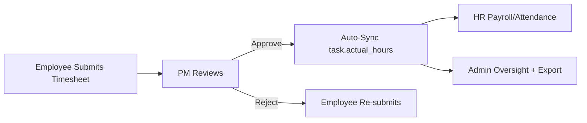

# Integrated Timesheet System — Implementation Walkthrough

## Overview

Implemented a production-grade, multi-role Timesheet system that replaces direct task-hour logging with a formal submission → approval → sync workflow. All hours now flow through a single audited pipeline.

## Architecture

## Files Modified

### Schema & Model
| File | Change |
|------|--------|
| [schema.sql](file:///c:/JGpc/app_at_present/schema.sql) | Added `timesheets` table with FK constraints and unique index |
| [models.py](file:///c:/JGpc/app_at_present/app/models.py) | Added `Timesheet` model + `Employee.timesheets` relationship |

### Employee Module
| File | Change |
|------|--------|
| [forms.py](file:///c:/JGpc/app_at_present/app/employee/forms.py) | Added `TimesheetForm` |
| [services.py](file:///c:/JGpc/app_at_present/app/employee/services.py) | Added 6 timesheet service functions |
| [routes.py](file:///c:/JGpc/app_at_present/app/employee/routes.py) | Added 3 routes, deprecated `log_task_hours` |

### PM Module
| File | Change |
|------|--------|
| [routes.py](file:///c:/JGpc/app_at_present/app/pm/routes.py) | Added 4 approval routes, deprecated `log_task_hours` |

### HR Module
| File | Change |
|------|--------|
| [routes.py](file:///c:/JGpc/app_at_present/app/hr/routes.py) | Added 2 routes (org-wide view + attendance comparison) |

### Admin Module
| File | Change |
|------|--------|
| [routes.py](file:///c:/JGpc/app_at_present/app/admin/routes.py) | Added 4 routes (global view, force-approve/reject, CSV/Excel export) |

### Templates Created
| Template | Purpose |
|----------|---------|
| [my_timesheets.html](file:///c:/JGpc/app_at_present/app/templates/employee/my_timesheets.html) | Employee timesheet list with filters + summary cards |
| [timesheet_form.html](file:///c:/JGpc/app_at_present/app/templates/employee/timesheet_form.html) | Submission form with AJAX task dropdown |
| [timesheet_approvals.html](file:///c:/JGpc/app_at_present/app/templates/pm/timesheet_approvals.html) | PM approval dashboard with bulk approve |
| [timesheets.html](file:///c:/JGpc/app_at_present/app/templates/hr/timesheets.html) | HR org-wide view with department filter |
| [timesheet_comparison.html](file:///c:/JGpc/app_at_present/app/templates/hr/timesheet_comparison.html) | Attendance vs. timesheet comparison with overtime flags |
| [timesheets.html](file:///c:/JGpc/app_at_present/app/templates/admin/timesheets.html) | Admin global report with force-actions + export |

### Templates Updated
| Template | Change |
|----------|--------|
| [dashboard.html (employee)](file:///c:/JGpc/app_at_present/app/templates/employee/dashboard.html) | Added timesheet summary card, replaced old Log Hours modal |
| [my_tasks.html](file:///c:/JGpc/app_at_present/app/templates/employee/my_tasks.html) | Replaced old Log Hours modal with timesheet link |
| [dashboard.html (PM)](file:///c:/JGpc/app_at_present/app/templates/pm/dashboard.html) | Added "Pending Timesheets" stat card |
| [project_detail.html](file:///c:/JGpc/app_at_present/app/templates/pm/project_detail.html) | Replaced old Log Hours modal with timesheet link |
| [base.html](file:///c:/JGpc/app_at_present/app/templates/base.html) | Added sidebar navigation links for all 4 modules |

## Key Design Decisions

1. **Single Source of Truth**: Removed all direct `task.actual_hours` modifications. Hours only update when a PM approves a timesheet entry.
2. **Auto-Sync on Approval**: When PM approves, `task.actual_hours += timesheet.hours_worked` automatically.
3. **Hour Reversal on Admin Force-Reject**: If admin force-rejects an already-approved entry, the synced hours are subtracted.
4. **Rejected Entry Re-submission**: Employees can edit and re-submit rejected timesheets (same project/task/date).
5. **UNIQUE constraint**: `(employee_id, project_id, task_id, date)` prevents duplicate entries.

## Route Summary (12 new endpoints)

| Route | Method | Purpose |
|-------|--------|---------|
| `/employee/timesheets` | GET | Employee timesheet list |
| `/employee/timesheets/submit` | GET/POST | Submit new timesheet |
| `/employee/api/tasks-for-project/<id>` | GET | AJAX task dropdown |
| `/pm/timesheet-approvals` | GET | PM approval dashboard |
| `/pm/timesheets/<id>/approve` | POST | Approve single entry |
| `/pm/timesheets/<id>/reject` | POST | Reject with reason |
| `/pm/timesheets/bulk-approve` | POST | Batch approve |
| `/hr/timesheets` | GET | Org-wide view |
| `/hr/timesheets/attendance-comparison` | GET | Attendance vs. timesheet |
| `/admin/timesheets` | GET | Global report |
| `/admin/timesheets/<id>/force-approve` | POST | Admin override approve |
| `/admin/timesheets/<id>/force-reject` | POST | Admin override reject |
| `/admin/timesheets/export` | GET | CSV/Excel export |

## Verification

- ✅ App starts cleanly with `db.create_all()`
- ✅ All 12+ timesheet routes registered (149 total routes)
- ✅ No remaining references to old `log_task_hours` in templates
- ✅ Sidebar navigation links added for all modules
