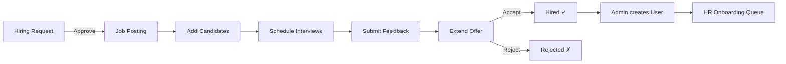

# Recruitment Workflow — Implementation Walkthrough

## Summary

Upgraded the HR module's basic recruitment feature into a **full end-to-end hiring workflow pipeline**:

**Job Request → Screening → Interview → Offer → Hired**

Admin manually creates the user account after a candidate is marked "Hired" (per user's requirement).

---

## Changes Made

### Models — [models.py](file:///c:/JGpc/app_at_present/app/models.py)

| Model | Change | Details |
|---|---|---|
| `JobPosting` | **Enhanced** | Added `salary_min`, `salary_max`, `employment_type`, `location` + `salary_range_display` and `hired_count` properties |
| `Candidate` | **Enhanced** | Added `source` field + `avg_interview_rating` and `days_in_pipeline` computed properties |
| `HiringRequest` | **New** | Full approval workflow: Pending → Approved → Converted (to Job Posting) or Rejected |
| `Offer` | **New** | Salary, designation, joining date, status tracking (Pending/Accepted/Rejected/Withdrawn) |

---

### Forms — [forms.py](file:///c:/JGpc/app_at_present/app/hr/forms.py)

- **Updated**: `JobPostingForm` (salary range, employment type, location)
- **Updated**: `CandidateForm` (source dropdown, resume file upload)
- **New**: `HiringRequestForm`, `OfferForm`, `HiringRequestRejectForm`

---

### Services — [services.py](file:///c:/JGpc/app_at_present/app/hr/services.py)

Added 9 new recruitment service functions:

| Function | Purpose |
|---|---|
| `get_pipeline_stats()` | Candidate counts per status stage |
| `get_recruitment_dashboard_stats()` | Summary stats for HR dashboard |
| `approve_hiring_request()` | Approve → status becomes "Approved" |
| `convert_hiring_request_to_job()` | Auto-create JobPosting from approved request |
| `reject_hiring_request()` | Reject with reason |
| `extend_offer()` | Create offer + auto-update candidate to "Offer" |
| `respond_to_offer()` | Accept (→ Hired) or reject |
| `withdraw_offer()` | Withdraw pending offer |
| `save_resume_file()` | Save uploaded resume with unique filename |

---

### Routes — [routes.py](file:///c:/JGpc/app_at_present/app/hr/routes.py)

**18 recruitment routes** registered:

| Route | Method | Purpose |
|---|---|---|
| `/hr/recruitment` | GET | Main listing with pipeline stats |
| `/hr/recruitment/pipeline` | GET | Kanban board view |
| `/hr/recruitment/jobs/add` | GET/POST | Create job posting |
| `/hr/recruitment/jobs/<id>/edit` | GET/POST | Edit job posting |
| `/hr/recruitment/jobs/<id>` | GET | Job detail with candidate table |
| `/hr/recruitment/jobs/<id>/candidates/add` | GET/POST | Add candidate with resume |
| `/hr/recruitment/candidates/<id>` | GET | Full candidate profile |
| `/hr/recruitment/candidates/<id>/edit` | GET/POST | Edit candidate |
| `/hr/recruitment/candidates/<id>/interview` | GET/POST | Schedule interview |
| `/hr/recruitment/candidates/<id>/offer` | GET/POST | Extend offer |
| `/hr/recruitment/interviews/<id>/feedback` | GET/POST | Interview feedback |
| `/hr/recruitment/offers/<id>/respond` | POST | Accept/reject offer |
| `/hr/recruitment/offers/<id>/withdraw` | POST | Withdraw offer |
| `/hr/recruitment/hiring-requests` | GET | List hiring requests |
| `/hr/recruitment/hiring-requests/add` | GET/POST | Submit new request |
| `/hr/recruitment/hiring-requests/<id>/approve` | POST | Approve request |
| `/hr/recruitment/hiring-requests/<id>/reject` | POST | Reject request |
| `/hr/recruitment/hiring-requests/<id>/convert` | POST | Convert to job posting |
| `/hr/recruitment/resume/<filename>` | GET | Download resume |

---

### Templates

| Template | Status | Purpose |
|---|---|---|
| `recruitment.html` | **Rewritten** | Pipeline stats bar, hiring request badge, offer alerts, rich table |
| `pipeline.html` | **New** | Kanban board with 5 stage columns and candidate cards |
| `candidate_detail.html` | **New** | Full profile card, interview history, offer section, actions |
| `hiring_requests.html` | **New** | Request listing with approve/reject modals, convert-to-job |
| `hiring_request_form.html` | **New** | Hiring request submission form |
| `offer_form.html` | **New** | Offer extension form |
| `job_detail.html` | **Rewritten** | Job info card, mini pipeline, candidate table with inline interviews |
| `candidate_form.html` | **Updated** | Added source dropdown and resume upload |
| `job_form.html` | **Updated** | Added salary range, employment type, location |
| `dashboard.html` | **Updated** | Recruitment badge on Quick Actions |

---

### Schema — [schema.sql](file:///c:/JGpc/app_at_present/schema.sql)

Added DDLs for `hiring_requests` and `offers` tables.

---

## Workflow Flow

## Verification

- ✅ App starts without errors
- ✅ All database tables created successfully
- ✅ All 18 recruitment routes registered and accessible
- ✅ No import errors
